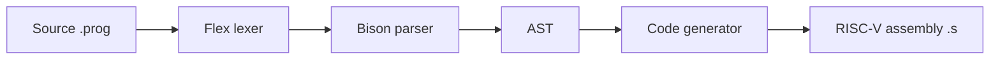

# RISC-V Compiler

Компилятор небольшого учебного языка в ассемблер RISC-V, написанный на C++ с использованием Flex и Bison. Проект проходит классический compiler pipeline: лексический анализ → синтаксический анализ → AST → генерация целевого кода.

## Что реализовано

- собственный синтаксис языка с `int` и `string`;
- объявления переменных и присваивания;
- арифметика `+`, `-`, `*`, `/`;
- сравнения и логические операции;
- `if / else`;
- циклы `while`;
- `print`;
- однострочные комментарии;
- построение AST;
- генерация RISC-V assembler;
- автоматический прогон набора тестовых программ.

## Pipeline



## Пример

Исходная программа:

```text
int i;
i = 0;

while (i < 3) {
    print i;
    i = i + 1;
}

if (i > 2) {
    print 100;
}
```

На выходе компилятор формирует RISC-V assembler с секциями `.data` и `.text`, метками для ветвлений и циклов, работой со стеком и инструкциями `ecall` для вывода и завершения программы.

## Архитектура

### Lexer

`src/lexer.l` на Flex отвечает за распознавание ключевых слов, идентификаторов, числовых и строковых литералов, операторов и комментариев.

### Parser

`src/parser.y` на Bison определяет грамматику языка, приоритеты операторов и создаёт узлы AST.

### AST

Иерархия узлов покрывает основные конструкции языка:

- `ProgramNode`;
- `VarDeclNode`;
- `AssignNode`;
- `PrintNode`;
- `IfNode`;
- `WhileNode`;
- `BlockNode`;
- `BinaryOpNode`;
- `UnaryOpNode`;
- `IdentifierNode`;
- `IntLiteralNode`;
- `StringLiteralNode`.

### Code generation

`CodeGenerator` обходит AST и формирует RISC-V assembler. Для временных значений и локальных переменных используется стек; для control flow генерируются уникальные метки и переходы.

## Стек технологий

- C++17
- Flex 2.6+
- Bison 3.0+
- CMake 3.16+
- RISC-V assembly
- Bash для запуска набора тестов

## Структура

```text
risc-v-compiler/
├── src/
│   ├── lexer.l
│   ├── parser.y
│   ├── ast.hpp
│   ├── ast.cpp
│   ├── codegen.hpp
│   ├── codegen.cpp
│   └── main.cpp
├── tests/                  # программы на исходном языке
├── cmake/
├── CMakeLists.txt
├── run_tests.sh
└── README.md
```

## Сборка

```bash
git clone https://github.com/andrey8080/risc-v-compiler.git
cd risc-v-compiler

cmake -S . -B build
cmake --build build
```

Исполняемый файл будет создан в:

```text
build/bin/compiler
```

## Использование

Вывести сгенерированный assembler в stdout:

```bash
./build/bin/compiler tests/test.prog
```

Записать его в файл:

```bash
./build/bin/compiler tests/test.prog output.s
```

## Тестирование

```bash
./run_tests.sh
```

или через CMake target:

```bash
cmake --build build --target test-all
```

Текущий test runner последовательно компилирует `.prog`-файлы из каталога `tests/` и проверяет, что компилятор завершился успешно и создал выходной assembler-файл.

## Поддерживаемый язык

### Типы

```text
int
string
```

### Управляющие конструкции

```text
if (...) { ... } else { ... }
while (...) { ... }
```

### Операторы

```text
+  -  *  /
<  <=  >  >=  ==  !=
and  or  not
```

## Известные ограничения

- полноценная работа со строковыми переменными пока не реализована;
- статической проверки типов нет;
- диагностика ошибок ограничена;
- существующий test runner проверяет процесс компиляции, но не выполняет сгенерированный RISC-V-код в эмуляторе.

## О проекте

Проект сделан как практическая реализация базовых этапов работы компилятора: от токенизации исходного текста и построения AST до генерации кода для конкретной архитектуры команд.